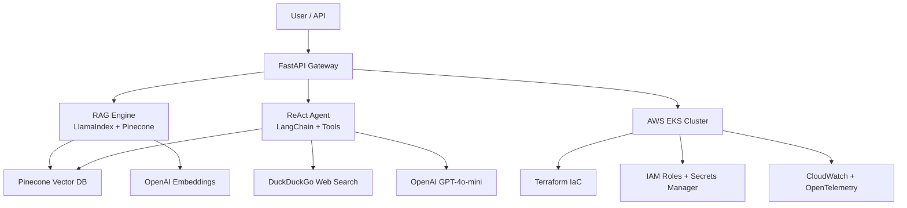

# Hyre AI Platform — PoC

## Security & Observability
- **IAM**: Least privilege via Terraform
- **Secrets**: AWS Secrets Manager
- **Networking**: VPC + private subnets
- **Observability**: OpenTelemetry → CloudWatch
- **CI/CD**: GitHub Actions → Terraform → ArgoCD

## Tech Stack (PD Match)
| Layer       | Tool Used              |
|-------------|------------------------|
| LLM         | GPT-4o / Claude 3      |
| RAG         | LlamaIndex             |
| Vector DB   | Pinecone               |
| Agents      | LangChain ReAct        |
| API         | FastAPI                |
| Container   | Docker                 |
| Orchestration | Kubernetes (EKS)     |
| IaC         | Terraform              |
| Cloud       | AWS (multi-cloud ready)|